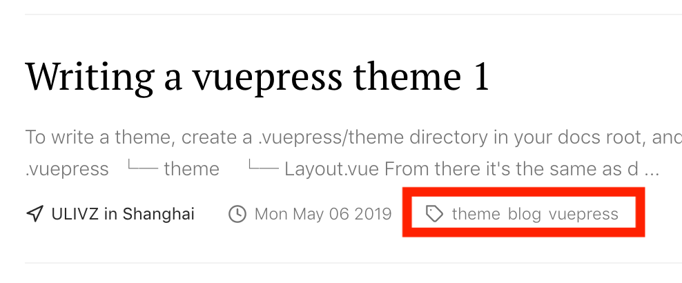
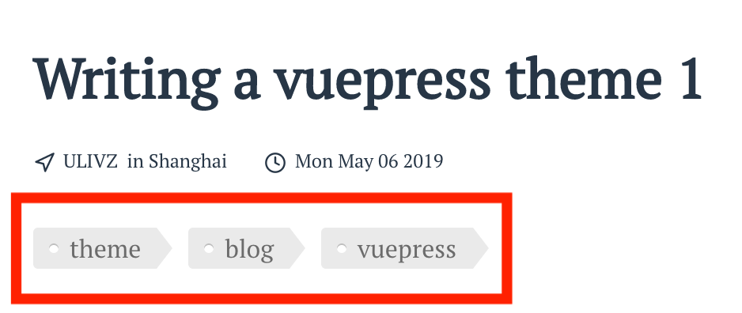
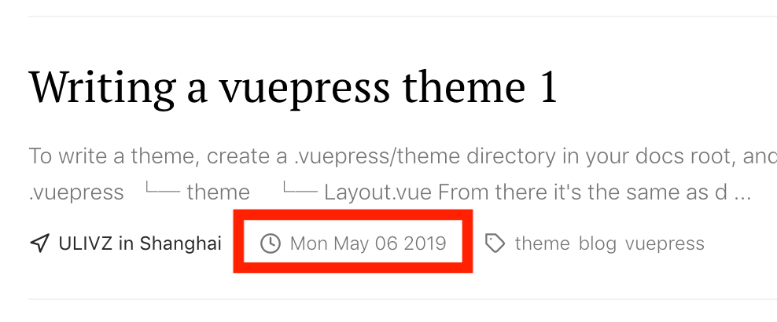
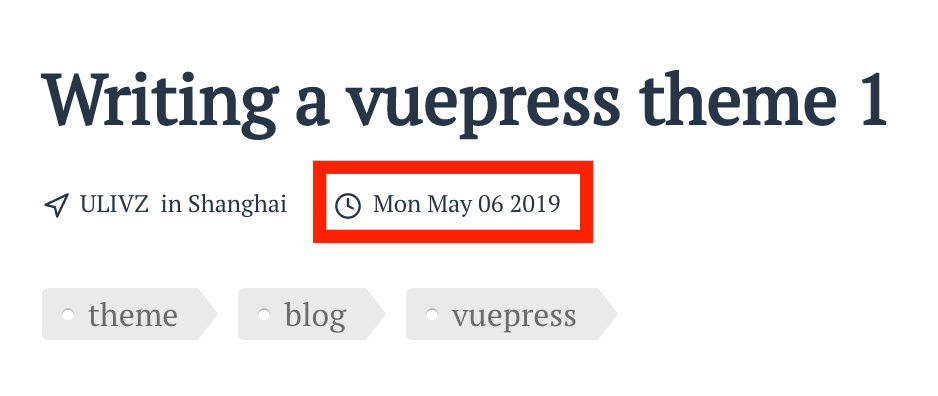
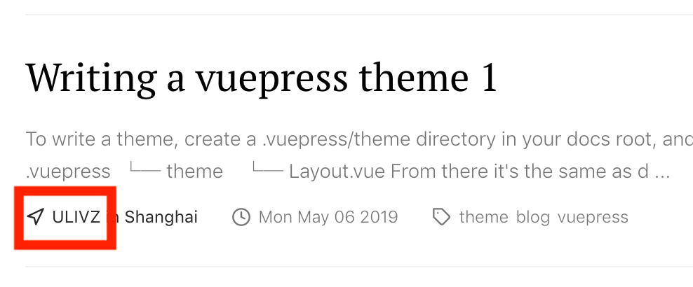
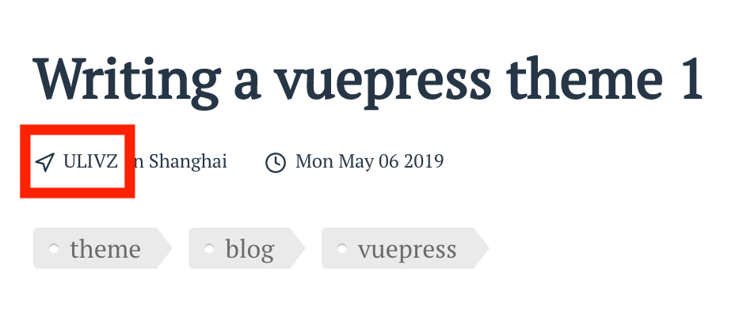
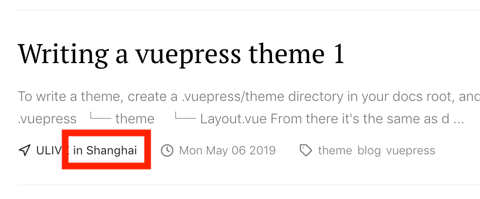
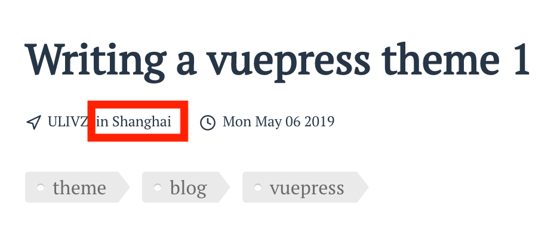

# Front Matter

## title

- Type: `string`
- Default: `undefined`
- Required: `true`

The title for the page and content.

e.g.

```markdown
---
title: Hello World
---
```

## tags

- Type: `string|string[]`
- Default: `undefined`
- Required: `false`

The key to classifier pages and will also be displayed in the post:




e.g.

```markdown
---
tags: 
  - JavaScript
  - DOM
---
```

## date

- Type: `YYYY-MM-DD`
- Default: `undefined`
- Required: `false`

Date for the post. This will be used for permalink and displayed in the post:




e.g.
```markdown
---
date: 2016-10-20
---
```

## author

- Type: `string`
- Default: `undefined`
- Required: `false`

Author for the post. This will be displayed in the post:




e.g.

```markdown
---
author: ULIVZ
---
```

## location

- Type: `string`
- Default: `undefined`
- Required: `false`

Location for the post. This will be displayed in the post:




e.g.

```markdown
---
location: Hangzhou
---
```

## summary

- Type: `string`
- Default: `undefined`
- Required: `false`

Summary for the post. This will be displayed in the post:


e.g.

```markdown
---
summary: Here's a quick post on what I found.
---
```
